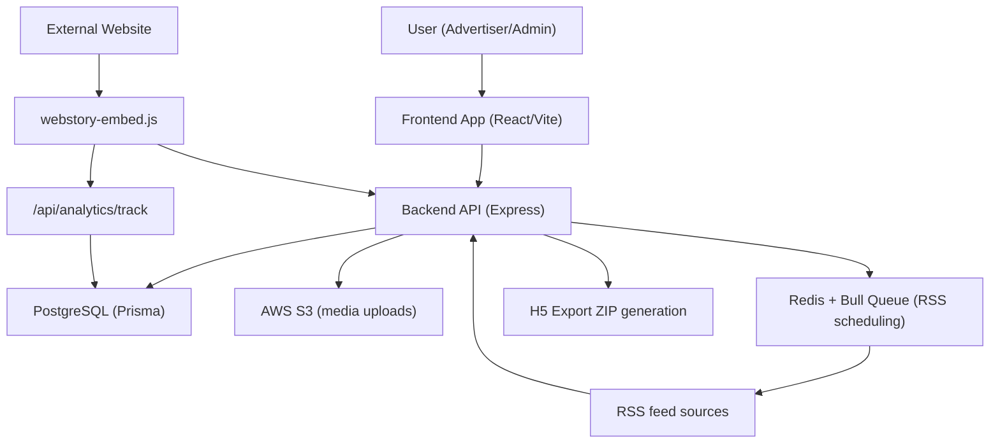
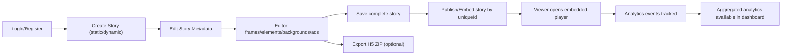
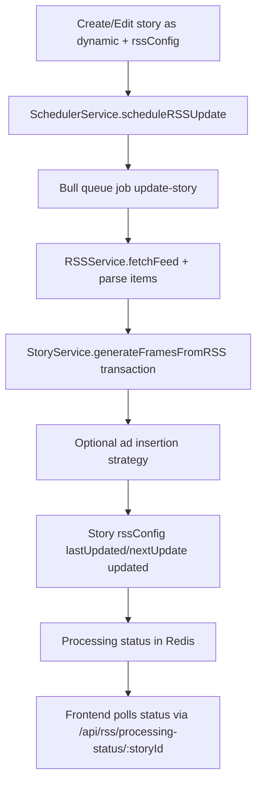

# Snappy Project KT Guide (Top-Down)

## Note

This legacy single-file KT has now been split into a flow-based multi-file documentation set for detailed onboarding:

- `/Users/devscript/Documents/UndrAds/Snappy/docs/kt/README.md`

Recommended: use the split docs for new KT sessions.

This document is for onboarding a new intern and transferring complete project context for the Snappy platform.

It explains:
- What the system is
- Why each part exists
- Where each part lives in code
- When each part is used
- How each part works end-to-end

---

## 1. What This Project Is

Snappy is a web-story creation and distribution platform.

Core capabilities:
- Authenticated users create and manage stories (static or dynamic).
- Dynamic stories pull content from RSS feeds and auto-generate frames.
- Stories can be embedded on external sites through a standalone embed script.
- Viewer behavior is tracked and aggregated into analytics.
- Stories can be exported to Google H5 ad ZIP format.
- Admin users manage advertisers, users, and all stories.

Primary stack:
- Frontend: React + Vite + TypeScript
- Backend: Express + TypeScript + Prisma
- DB: PostgreSQL
- Queue: Bull + Redis (RSS jobs)
- Storage: AWS S3 (uploads)
- Infra: Docker Compose + Nginx reverse proxy

---

## 2. Top-Level Architecture

Production routing:
- Nginx proxies `/api/*` and `/health` to backend.
- Nginx serves frontend and static assets (including `webstory-embed.js`).

---

## 3. Repository Structure (Top-Down)

### Root
- `/Users/devscript/Documents/UndrAds/Snappy/package.json`: workspace scripts.
- `/Users/devscript/Documents/UndrAds/Snappy/docker-compose.yml`: local/prod-ish service orchestration.
- `/Users/devscript/Documents/UndrAds/Snappy/deploy.sh`: zero-downtime deployment script.
- `/Users/devscript/Documents/UndrAds/Snappy/nginx.conf`: reverse-proxy config.

### Backend App
- `/Users/devscript/Documents/UndrAds/Snappy/apps/backend/src/index.ts`: backend entrypoint.
- `/Users/devscript/Documents/UndrAds/Snappy/apps/backend/prisma/schema.prisma`: DB schema.
- `/Users/devscript/Documents/UndrAds/Snappy/apps/backend/src/routes`: route definitions.
- `/Users/devscript/Documents/UndrAds/Snappy/apps/backend/src/controllers`: request orchestration.
- `/Users/devscript/Documents/UndrAds/Snappy/apps/backend/src/services`: business logic/integrations.
- `/Users/devscript/Documents/UndrAds/Snappy/apps/backend/src/middleware`: auth/validation/error handling.

### Frontend App
- `/Users/devscript/Documents/UndrAds/Snappy/apps/frontend/src/main.tsx`: app bootstrap.
- `/Users/devscript/Documents/UndrAds/Snappy/apps/frontend/src/App.tsx`: route map and guards.
- `/Users/devscript/Documents/UndrAds/Snappy/apps/frontend/src/pages`: page-level features.
- `/Users/devscript/Documents/UndrAds/Snappy/apps/frontend/src/pages/editor`: editor module.
- `/Users/devscript/Documents/UndrAds/Snappy/apps/frontend/src/lib/api.ts`: typed API client.
- `/Users/devscript/Documents/UndrAds/Snappy/apps/frontend/public/webstory-embed.js`: embeddable player.

### Shared Contracts
- `/Users/devscript/Documents/UndrAds/Snappy/packages/shared-types/src/index.ts`: shared TS types.

---

## 4. End-to-End Core Flows

## 4.1 Story Lifecycle Flow

## 4.2 Dynamic RSS Story Flow

---

## 5. Backend Design (How / When / Where / Why)

## 5.1 Entry and Middleware

Where:
- `/Users/devscript/Documents/UndrAds/Snappy/apps/backend/src/index.ts`

How:
- Boots Express, DB connection, scheduler init.
- Registers middleware: helmet, CORS on `/api`, JSON parsers, morgan in dev.
- Registers routes under `/api/*`.
- Provides `/health`.
- Applies notFound and errorHandler.

When:
- On backend process start.

Why:
- Centralized request pipeline and service initialization.

## 5.2 Authentication and Authorization

Where:
- Auth routes: `/Users/devscript/Documents/UndrAds/Snappy/apps/backend/src/routes/auth.ts`
- Auth controller: `/Users/devscript/Documents/UndrAds/Snappy/apps/backend/src/controllers/authController.ts`
- JWT middleware: `/Users/devscript/Documents/UndrAds/Snappy/apps/backend/src/middleware/auth.ts`
- Admin guard: `/Users/devscript/Documents/UndrAds/Snappy/apps/backend/src/middleware/admin.ts`

How:
- Register/login creates/verifies user, hashes password, issues JWT with role.
- Protected routes read `Authorization: Bearer <token>`.
- Admin routes require `role=admin`.

When:
- Every protected API call.

Why:
- Enforce access control by user ownership and admin privileges.

## 5.3 Story Management

Where:
- Routes: `/Users/devscript/Documents/UndrAds/Snappy/apps/backend/src/routes/stories.ts`
- Controller: `/Users/devscript/Documents/UndrAds/Snappy/apps/backend/src/controllers/storyController.ts`
- Service: `/Users/devscript/Documents/UndrAds/Snappy/apps/backend/src/services/storyService.ts`

How:
- CRUD on stories, frames, elements, backgrounds.
- Public fetch by `uniqueId` for embed players.
- `save-complete` rewrites full frame tree from editor payload.
- Admin path bypasses ownership checks.

When:
- Dashboard/edit/editor workflows.

Why:
- Support iterative story authoring with fine-grained editor entities.

## 5.4 RSS Automation

Where:
- RSS routes/controller: `/Users/devscript/Documents/UndrAds/Snappy/apps/backend/src/routes/rss.ts`, `/Users/devscript/Documents/UndrAds/Snappy/apps/backend/src/controllers/rssController.ts`
- RSS parser: `/Users/devscript/Documents/UndrAds/Snappy/apps/backend/src/services/rssService.ts`
- Scheduler/queue: `/Users/devscript/Documents/UndrAds/Snappy/apps/backend/src/services/schedulerService.ts`
- Frame generation logic: `/Users/devscript/Documents/UndrAds/Snappy/apps/backend/src/services/storyService.ts`

How:
- Validates feed URL.
- Schedules immediate + recurring jobs via Bull.
- Jobs fetch feed items and generate story frames in Prisma transaction.
- Stores progress in Redis (`rss-processing:<storyId>`).
- Applies ad insertion strategy (`start-end`, `alternate`, `interval`).

When:
- Dynamic story creation, config updates, manual trigger, backend startup re-initialization.

Why:
- Keep dynamic stories fresh without manual editing.

## 5.5 Uploads and S3

Where:
- Routes/controller: `/Users/devscript/Documents/UndrAds/Snappy/apps/backend/src/routes/uploads.ts`, `/Users/devscript/Documents/UndrAds/Snappy/apps/backend/src/controllers/uploadController.ts`
- Upload service: `/Users/devscript/Documents/UndrAds/Snappy/apps/backend/src/services/uploadService.ts`
- S3 integration: `/Users/devscript/Documents/UndrAds/Snappy/apps/backend/src/services/s3Service.ts`

How:
- Multer accepts image uploads into memory.
- S3 service uploads with generated key and returns public URL.

When:
- Publisher image/background/media uploads from frontend.

Why:
- Decouple storage from app container filesystem and scale media hosting.

## 5.6 Analytics

Where:
- Routes/controller: `/Users/devscript/Documents/UndrAds/Snappy/apps/backend/src/routes/analytics.ts`, `/Users/devscript/Documents/UndrAds/Snappy/apps/backend/src/controllers/analyticsController.ts`
- Service: `/Users/devscript/Documents/UndrAds/Snappy/apps/backend/src/services/analyticsService.ts`

How:
- Public event ingestion endpoint `/api/analytics/track`.
- Persists raw events in `story_analytics_events`.
- Debounced aggregation (5s inactivity) computes summary metrics and upserts `story_analytics`.
- Supports story-wise, user-wise, events list, and day-wise metrics.

When:
- Viewer interacts with embedded story.

Why:
- Keep event tracking lightweight while still serving fast dashboards.

## 5.7 H5 Export

Where:
- Routes/controller: `.../routes/stories.ts`, `.../controllers/exportController.ts`
- Service: `/Users/devscript/Documents/UndrAds/Snappy/apps/backend/src/services/exportService.ts`

How:
- Resolves story by id/uniqueId.
- Downloads referenced images, compresses/minifies assets.
- Produces zip with `index.html` + images.
- Streams zip to client and cleans temp files.

When:
- User clicks export in editor or edit page.

Why:
- Enable ad-network-compatible deliverables (Google H5 style).

## 5.8 Content Scraper

Where:
- Route: `/Users/devscript/Documents/UndrAds/Snappy/apps/backend/src/routes/content.ts`
- Service: `/Users/devscript/Documents/UndrAds/Snappy/apps/backend/src/services/contentScraperService.ts`

How:
- Fetches target HTML via axios.
- Extracts headlines/title/description/images via cheerio.

When:
- Automated story assistance flows in editor.

Why:
- Accelerate frame creation from existing web content.

---

## 6. Database Model (Prisma)

Where:
- `/Users/devscript/Documents/UndrAds/Snappy/apps/backend/prisma/schema.prisma`

Main entities:
- `User`: auth identity and role.
- `Story`: top-level story metadata (type, format, embed config, RSS config).
- `StoryFrame`: ordered frames (`story`/`ad`), optional link/linkText, duration.
- `StoryElement`: frame elements (`text`/`image`/`shape`) with style JSON.
- `StoryBackground`: per-frame background config.
- `StoryAnalytics`: aggregated metrics per story.
- `StoryAnalyticsEvent`: raw event stream.

Design intent:
- Normalize editor entities for direct CRUD.
- Keep flexible UI configs as JSON (`rssConfig`, `embedConfig`, `adConfig`, style JSON).
- Separate raw events from aggregated read model.

---

## 7. API Surface (Backend)

Base URL:
- Local direct backend: `http://localhost:3000`
- Via nginx: `http://localhost`

Main route groups:
- `/api/auth`: register/login
- `/api/users`: profile CRUD
- `/api/stories`: story + frame + element + background + export
- `/api/uploads`: single/multiple image upload
- `/api/content`: website scrape
- `/api/rss`: feed validation, config/toggle/trigger, queue status
- `/api/analytics`: event tracking + read endpoints
- `/api/admin`: admin stats/users/stories/analytics management
- `/health`: service health check

For complete contracts, use:
- `/Users/devscript/Documents/UndrAds/Snappy/apps/backend/src/routes/*.ts`

---

## 8. Frontend Design (How / When / Where / Why)

## 8.1 App Bootstrap and Route Guarding

Where:
- `/Users/devscript/Documents/UndrAds/Snappy/apps/frontend/src/main.tsx`
- `/Users/devscript/Documents/UndrAds/Snappy/apps/frontend/src/App.tsx`
- `/Users/devscript/Documents/UndrAds/Snappy/apps/frontend/src/hooks/useAuth.ts`

How:
- React Query client wraps app.
- Protected and admin-only route wrappers gate pages.
- JWT/user persisted in `localStorage`.

When:
- On app load and route transitions.

Why:
- Prevent unauthorized access and keep role-based UI behavior.

## 8.2 Main Product Pages

Where:
- Create: `/Users/devscript/Documents/UndrAds/Snappy/apps/frontend/src/pages/CreateSnapPage.tsx`
- Edit metadata: `/Users/devscript/Documents/UndrAds/Snappy/apps/frontend/src/pages/EditStoryPage.tsx`
- Editor: `/Users/devscript/Documents/UndrAds/Snappy/apps/frontend/src/pages/editor/EditorPage.tsx`
- Dashboard: `/Users/devscript/Documents/UndrAds/Snappy/apps/frontend/src/pages/DashboardHomePage.tsx`
- Analytics pages: `.../AnalyticsPage.tsx`, `.../StoryAnalyticsPage.tsx`
- Admin: `.../AdminDashboardPage.tsx`, `.../UserAnalyticsPage.tsx`

How:
- Create/Edit configure story metadata and dynamic RSS options.
- Editor handles frame/elements/background composition and full save.
- Analytics pages consume aggregated/day-wise APIs.
- Admin pages provide user/story management + system-level visibility.

When:
- During normal advertiser/admin operations.

Why:
- Separate responsibilities: setup vs editing vs monitoring vs governance.

## 8.3 API Client Layer

Where:
- `/Users/devscript/Documents/UndrAds/Snappy/apps/frontend/src/lib/api.ts`

How:
- Axios instance with auth interceptor.
- Typed wrappers per domain (`authAPI`, `storyAPI`, `rssAPI`, etc.).

When:
- Every frontend-backend call.

Why:
- Standardized error handling and reusable request contracts.

## 8.4 Embed Runtime (External Websites)

Where:
- `/Users/devscript/Documents/UndrAds/Snappy/apps/frontend/public/webstory-embed.js`

How:
- Scans `<ins id="snappy-webstory-*">` elements.
- Fetches public story by `uniqueId`.
- Renders interactive iframe player.
- Supports regular and floater embeds, autoplay/loop options, close button.
- Emits analytics events (`player_viewport`, `frame_view`, `cta_click`, `time_spent`, etc.).

When:
- On third-party pages embedding stories.

Why:
- Distribution channel independent of Snappy frontend app.

---

## 9. Shared Types and Contracts

Where:
- `/Users/devscript/Documents/UndrAds/Snappy/packages/shared-types/src/index.ts`

How:
- Shared TS interfaces for user/auth/story/frame/background/rss/embed/analytics API data.

When:
- Compile-time validation in both frontend and backend.

Why:
- Reduce contract drift between client and server.

---

## 10. Infrastructure and Deployment

## 10.1 Local/Container Topology

Where:
- `/Users/devscript/Documents/UndrAds/Snappy/docker-compose.yml`

Services:
- `postgres`
- `redis`
- `backend`
- `frontend`
- `nginx`

## 10.2 Deployment Script

Where:
- `/Users/devscript/Documents/UndrAds/Snappy/deploy.sh`

How:
- Preflight checks.
- Build backend/frontend images.
- Rolling update backend then frontend.
- Optional migration step (`prisma migrate deploy`).
- Nginx reload for near-zero downtime behavior.

When:
- Production deployments.

Why:
- Safer updates without full app outage.

## 10.3 Nginx Reverse Proxy

Where:
- `/Users/devscript/Documents/UndrAds/Snappy/nginx.conf`

How:
- Routes `/api/*` and `/health` to backend.
- Serves frontend and embed JS.
- Sets headers, compression, upload limits.

When:
- Runtime traffic entrypoint.

Why:
- Unified origin and routing for frontend + API.

---

## 11. Environment Configuration

Backend template:
- `/Users/devscript/Documents/UndrAds/Snappy/apps/backend/env.example`

Frontend template:
- `/Users/devscript/Documents/UndrAds/Snappy/apps/frontend/env.example`

Critical backend vars:
- `DATABASE_URL`
- `JWT_SECRET`
- `REDIS_HOST` / `REDIS_PORT`
- `AWS_REGION`, `AWS_ACCESS_KEY_ID`, `AWS_SECRET_ACCESS_KEY`, `S3_BUCKET_NAME`, `S3_BASE_URL`

S3 setup guide:
- `/Users/devscript/Documents/UndrAds/Snappy/apps/backend/docs/S3_SETUP.md`

---

## 12. Testing and Scripts

Backend tests:
- `/Users/devscript/Documents/UndrAds/Snappy/apps/backend/src/__tests__/auth.test.ts`
- `/Users/devscript/Documents/UndrAds/Snappy/apps/backend/src/__tests__/upload.test.ts`

Operational scripts:
- `/Users/devscript/Documents/UndrAds/Snappy/apps/backend/scripts/init-admin.ts`
- `/Users/devscript/Documents/UndrAds/Snappy/apps/backend/scripts/create-user.ts`
- `/Users/devscript/Documents/UndrAds/Snappy/apps/backend/scripts/convert-publishers-to-advertisers.ts`

Infra sanity script:
- `/Users/devscript/Documents/UndrAds/Snappy/test-setup.sh`

---

## 13. How/When/Where/Why Summary Matrix

| Module | Where | How | When | Why |
|---|---|---|---|---|
| Auth | backend auth routes/controllers/middleware | JWT + bcrypt + role checks | login/register/protected APIs | secure access |
| Story CRUD | story routes/controller/service | Prisma CRUD, ownership checks | create/edit/delete stories | core authoring workflow |
| Editor persistence | `save-complete` + frame APIs | full frame tree replace + granular updates | editor save or frame edits | flexible composition UX |
| Dynamic RSS | rss/scheduler/rssService/storyService | queue jobs + RSS parsing + frame generation | dynamic story lifecycle | automate content refresh |
| Uploads | upload controller/service + S3 service | multer memory + S3 PUT | media uploads | scalable external storage |
| Analytics | analytics controller/service + embed script | event ingest + debounced aggregate | story playback interactions | product insights & reporting |
| Export | export controller/service | generate zipped H5 package | export action in UI | ad-platform compatibility |
| Admin | admin routes/controller + story service admin methods | system-wide queries + elevated mutations | admin dashboard operations | governance/support |
| Frontend app | App/router/pages/hooks | route guards + API-driven UI | normal user sessions | user productivity |
| Embed runtime | `webstory-embed.js` | iframe renderer + tracking | external website embeds | distribution & monetization |

---

## 14. Known Implementation Notes for KT

- Role naming is historically mixed (`publisher` vs `advertiser`). Current backend logic uses `advertiser`; migration script exists to convert old records.
- Some duplicate checks/log-heavy blocks exist in controllers/services (especially RSS/story/editor paths). They are functional but can be cleaned later.
- Embed runtime script is large and highly stateful. Treat it as a product surface, not just a static utility.
- Analytics uses eventual consistency due to debounced aggregation; raw events are immediate, aggregates may lag by a few seconds.

---

## 15. Onboarding Plan for New Intern

Recommended sequence:
1. Read this document once fully.
2. Run local stack and test key endpoints (`/health`, auth, create story).
3. Create one static story and one dynamic RSS story from UI.
4. Open editor, save frames, and verify DB records.
5. Embed a story using `webstory-embed.js` in a test HTML page.
6. Trigger analytics events and verify dashboard metrics.
7. Export a story and inspect ZIP output.
8. Review admin flows and reassignment behavior.

Suggested first code tasks:
1. Add API docs generation or OpenAPI spec from route definitions.
2. Add tests for RSS scheduling and analytics aggregation edge cases.
3. Reduce duplicate logic in editor loading/saving paths.
