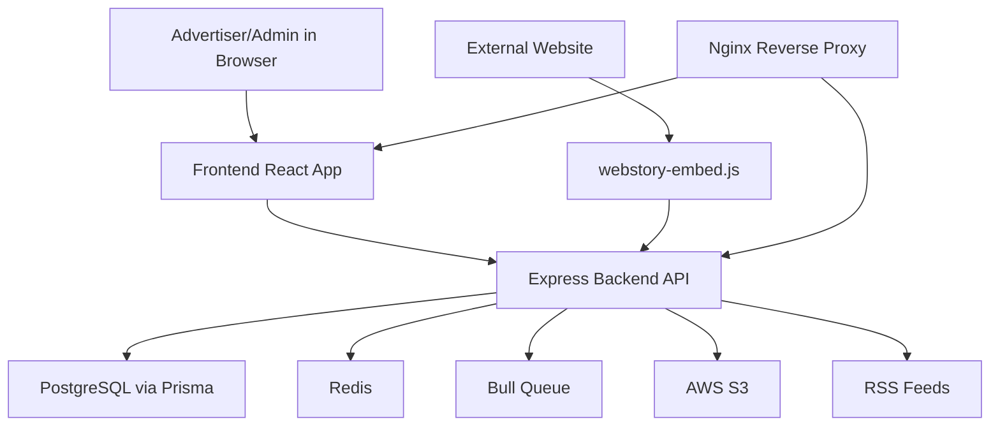

# 02. Architecture and Connections

## Full Component Map

## How Backend and Frontend Are Connected

Primary connection pattern:
- Frontend calls backend REST APIs via `/api/*`.
- Frontend Axios client lives in `/Users/devscript/Documents/UndrAds/Snappy/apps/frontend/src/lib/api.ts`.
- Backend route handlers live in `/Users/devscript/Documents/UndrAds/Snappy/apps/backend/src/routes`.

Authentication connection:
- Frontend stores JWT in `localStorage`.
- Axios interceptor attaches `Authorization: Bearer <token>`.
- Backend middleware validates JWT and injects `req.user`.

Role-based connection:
- Frontend route guards hide/protect admin pages.
- Backend still enforces role checks (`requireAdmin`), so security is server-side.

## How Backend Is Connected to Data and Integrations

### PostgreSQL
- Prisma schema: `/Users/devscript/Documents/UndrAds/Snappy/apps/backend/prisma/schema.prisma`
- Every story/frame/analytics action ultimately persists in DB.

### Redis + Bull
- Scheduler service creates queue jobs for dynamic stories.
- Processing status is cached in Redis key pattern `rss-processing:<storyId>`.
- Queue handles immediate and recurring RSS updates.

### AWS S3
- Upload endpoints accept media and store to S3.
- Backend stores S3 URLs in story/frame records.
- Export service can download from S3 for ZIP generation.

## Runtime Connectivity by Environment

### Local Dev
- Backend typically on `http://localhost:3000`
- Frontend typically on `http://localhost:5173`
- Frontend can use `VITE_API_URL` for backend base.

### Docker Compose / Production-like
- Nginx entrypoint on port `80` (or `APP_PORT`).
- Nginx routes:
  - `/api/*` -> backend
  - `/health` -> backend
  - web app routes -> frontend
  - static embed script -> served directly

## Request Path Examples

### Example A: Logged-in user loads dashboard stories
1. Browser opens frontend route `/`.
2. Frontend calls `GET /api/stories`.
3. Backend auth middleware validates token.
4. Story service fetches user-scoped stories from DB.
5. Response returned and rendered.

### Example B: Viewer opens embedded story
1. External page loads `webstory-embed.js`.
2. Script fetches public story `GET /api/stories/public/:uniqueId`.
3. Script renders iframe player.
4. Script posts analytics events to `POST /api/analytics/track`.

## Why This Architecture Was Chosen

- Monorepo keeps frontend/backend/shared contracts synchronized.
- Prisma gives strong schema and migration discipline.
- Bull + Redis provides resilient recurring jobs.
- S3 decouples media from app container lifecycle.
- Embed script enables distribution without requiring full app login.
