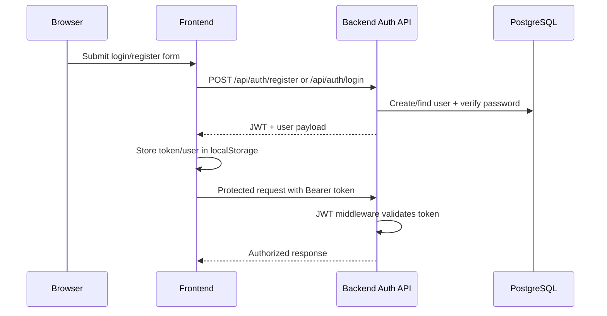

# 05. Flow: Auth and Access Control

## Flow Objective

Authenticate users, authorize actions by role, and keep frontend/backend access rules consistent.

## End-to-End Sequence

## Where It Lives

Backend:
- `/Users/devscript/Documents/UndrAds/Snappy/apps/backend/src/routes/auth.ts`
- `/Users/devscript/Documents/UndrAds/Snappy/apps/backend/src/controllers/authController.ts`
- `/Users/devscript/Documents/UndrAds/Snappy/apps/backend/src/middleware/auth.ts`
- `/Users/devscript/Documents/UndrAds/Snappy/apps/backend/src/middleware/admin.ts`

Frontend:
- `/Users/devscript/Documents/UndrAds/Snappy/apps/frontend/src/pages/LoginPage.tsx`
- `/Users/devscript/Documents/UndrAds/Snappy/apps/frontend/src/pages/RegisterPage.tsx`
- `/Users/devscript/Documents/UndrAds/Snappy/apps/frontend/src/hooks/useAuth.ts`
- `/Users/devscript/Documents/UndrAds/Snappy/apps/frontend/src/App.tsx`

## How It Works in Detail

1. Registration
- Backend validates email/password/name.
- Password hashed with bcrypt.
- User created with default role.
- JWT token returned with user payload.

2. Login
- Backend validates credentials.
- JWT token returned when valid.

3. Session persistence
- Frontend stores token + user object in local storage.
- On app mount, frontend restores session and refetches profile.

4. Protected APIs
- Axios interceptor adds bearer token.
- Backend JWT middleware verifies token and sets `req.user`.

5. Admin-only APIs
- Admin middleware checks role from token, then DB fallback if needed.

## Why It’s Implemented This Way

- JWT keeps backend stateless.
- Frontend route guards provide UX-level protection.
- Backend role checks provide real security.

## KT Notes

- Always rely on backend for authorization truth.
- Frontend role checks are convenience and should never be sole security barrier.
