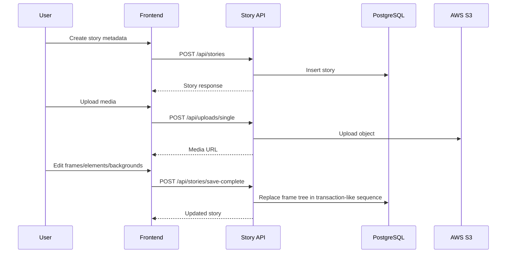

# 06. Flow: Story Creation and Editing

## Flow Objective

Create a story, configure metadata, author frame content in editor, and persist it reliably.

## End-to-End Sequence

## Where It Lives

Frontend create/edit/editor:
- `/Users/devscript/Documents/UndrAds/Snappy/apps/frontend/src/pages/CreateSnapPage.tsx`
- `/Users/devscript/Documents/UndrAds/Snappy/apps/frontend/src/pages/EditStoryPage.tsx`
- `/Users/devscript/Documents/UndrAds/Snappy/apps/frontend/src/pages/editor/EditorPage.tsx`

Backend story modules:
- `/Users/devscript/Documents/UndrAds/Snappy/apps/backend/src/routes/stories.ts`
- `/Users/devscript/Documents/UndrAds/Snappy/apps/backend/src/controllers/storyController.ts`
- `/Users/devscript/Documents/UndrAds/Snappy/apps/backend/src/services/storyService.ts`

Upload modules:
- `/Users/devscript/Documents/UndrAds/Snappy/apps/backend/src/routes/uploads.ts`
- `/Users/devscript/Documents/UndrAds/Snappy/apps/backend/src/services/uploadService.ts`
- `/Users/devscript/Documents/UndrAds/Snappy/apps/backend/src/services/s3Service.ts`

## Detailed Behavior

### Step A: Metadata phase
- Create page gathers title/publisher/format/device type/story type.
- Calls `POST /api/stories`.
- Backend assigns `uniqueId` if not provided.

### Step B: Media upload phase
- Frontend uploads image files via multipart.
- Backend validates mime + size and uploads to S3.
- Returned URL is stored in story/frame data.

### Step C: Editor phase
- Editor loads by `uniqueId` using public story endpoint.
- User modifies frame list and element properties.
- Save uses `save-complete` payload:
  - story metadata
  - full ordered frame list
  - element/background payloads

### Step D: Persistence strategy
- Existing frames are deleted and recreated for full synchronization.
- Keeps backend structure aligned with editor snapshot.

### Step E: Admin variant
- Admin can assign/reassign story ownership.
- Admin update paths bypass ownership checks.

## Why It’s Implemented This Way

- Full snapshot save avoids complex incremental conflict resolution.
- Separate metadata and deep editor keeps UX cleaner for non-technical users.
- S3 URLs as canonical media references simplify render/export flows.

## KT Verification Checklist

After intern updates this flow, verify:
1. Story appears in dashboard.
2. Frame order persists after reload.
3. Background and text styles persist.
4. S3 media URLs are valid and public.
5. Admin reassignment reflects in owner-based story lists.
