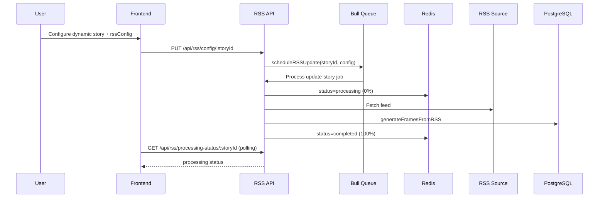

# 07. Flow: Dynamic RSS Automation

## Flow Objective

Automatically regenerate story frames from RSS feed items on initial trigger and recurring interval.

## End-to-End Sequence

## Where It Lives

Backend:
- `/Users/devscript/Documents/UndrAds/Snappy/apps/backend/src/routes/rss.ts`
- `/Users/devscript/Documents/UndrAds/Snappy/apps/backend/src/controllers/rssController.ts`
- `/Users/devscript/Documents/UndrAds/Snappy/apps/backend/src/services/schedulerService.ts`
- `/Users/devscript/Documents/UndrAds/Snappy/apps/backend/src/services/rssService.ts`
- `/Users/devscript/Documents/UndrAds/Snappy/apps/backend/src/services/storyService.ts`

Frontend:
- `/Users/devscript/Documents/UndrAds/Snappy/apps/frontend/src/pages/CreateSnapPage.tsx`
- `/Users/devscript/Documents/UndrAds/Snappy/apps/frontend/src/pages/EditStoryPage.tsx`
- `/Users/devscript/Documents/UndrAds/Snappy/apps/frontend/src/components/RSSProgressLoader.tsx`
- `/Users/devscript/Documents/UndrAds/Snappy/apps/frontend/src/components/RSSUpdateTimer.tsx`

## Detailed Behavior

1. User sets story type = `dynamic` and provides `rssConfig`.
2. Backend validates feed and config constraints.
3. Existing recurring job is canceled (if config updated).
4. Scheduler enqueues immediate run and optional recurring run.
5. Worker fetches feed items and normalizes media/link fields.
6. `generateFramesFromRSS` creates story frames and content.
7. Optional ad insertion applied according to strategy:
- `start-end`
- `alternate`
- `interval` (`before`/`after`/`between`)
8. Redis status updated during progress; frontend polls and shows progress.

## Why It’s Implemented This Way

- Queue decouples long-running feed processing from API latency.
- Redis status provides fast polling UX without expensive DB reads.
- Concurrency=1 reduces DB pool contention during heavy writes.

## Trigger Scenarios

1. New dynamic story created.
2. RSS config changed.
3. Manual trigger endpoint called.
4. Server restart and scheduler initialization picks active dynamic stories.

## Failure Handling

- Job retries with exponential backoff.
- Processing status set to `failed` with message.
- Frame generation has transaction retry for connection timeout errors.

## KT Validation Steps

1. Create dynamic story with valid feed.
2. Confirm progress transitions from processing to completed.
3. Check frames generated with link/image/title data.
4. Confirm recurring update occurs at configured interval.
5. Toggle RSS inactive and verify recurring job stops.
