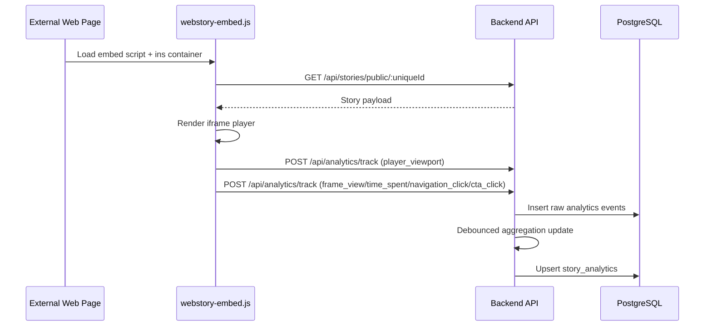

# 08. Flow: Embed and Analytics

## Flow Objective

Render stories on external websites and capture viewer analytics events end-to-end.

## End-to-End Sequence

## Where It Lives

Embed runtime:
- `/Users/devscript/Documents/UndrAds/Snappy/apps/frontend/public/webstory-embed.js`

Public story endpoint:
- `/Users/devscript/Documents/UndrAds/Snappy/apps/backend/src/routes/stories.ts`
- `/Users/devscript/Documents/UndrAds/Snappy/apps/backend/src/controllers/storyController.ts`

Analytics ingestion and aggregation:
- `/Users/devscript/Documents/UndrAds/Snappy/apps/backend/src/routes/analytics.ts`
- `/Users/devscript/Documents/UndrAds/Snappy/apps/backend/src/controllers/analyticsController.ts`
- `/Users/devscript/Documents/UndrAds/Snappy/apps/backend/src/services/analyticsService.ts`

Frontend analytics views:
- `/Users/devscript/Documents/UndrAds/Snappy/apps/frontend/src/pages/AnalyticsPage.tsx`
- `/Users/devscript/Documents/UndrAds/Snappy/apps/frontend/src/pages/StoryAnalyticsPage.tsx`

## Detailed Embed Behavior

1. Script discovers embed elements by ID pattern.
2. Resolves API base from script source or `data-api-url`.
3. Fetches story by unique ID.
4. Renders player in iframe with frame navigation/progress.
5. Optional floater mode can appear after scroll threshold.
6. Uses embed config for autoplay/loop/size options.

## Analytics Event Types

Events tracked include:
- `player_viewport`
- `frame_view`
- `time_spent`
- `navigation_click`
- `cta_click`
- `story_complete`

Aggregation model:
- Events inserted fast.
- Aggregates updated in debounced batches.
- Dashboards read from aggregate table and day-wise event analysis.

## Why This Design

- Public story endpoint enables unauthenticated embedding.
- Client-side event tracking captures real interaction timing.
- Debounce avoids heavy aggregate recompute during active sessions.

## Important Connection Note

Embed analytics route is intentionally public (`POST /api/analytics/track`) because viewers are not logged-in app users.

## KT Validation Steps

1. Embed a story in a plain HTML page.
2. Confirm story renders and frame navigation works.
3. Confirm `/api/analytics/track` calls occur in network logs.
4. Open Snappy analytics page and verify metrics update after short delay.
