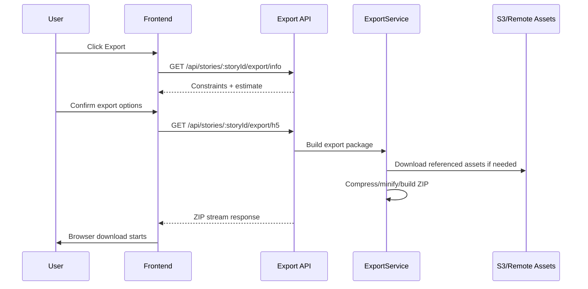

# 09. Flow: Export and Delivery

## Flow Objective

Convert authored stories into downloadable H5-compatible ZIP bundles.

## End-to-End Sequence

## Where It Lives

Frontend:
- `/Users/devscript/Documents/UndrAds/Snappy/apps/frontend/src/pages/editor/components/ExportModal.tsx`
- `/Users/devscript/Documents/UndrAds/Snappy/apps/frontend/src/lib/api.ts` (`storyAPI.exportToH5Ads`)

Backend:
- `/Users/devscript/Documents/UndrAds/Snappy/apps/backend/src/controllers/exportController.ts`
- `/Users/devscript/Documents/UndrAds/Snappy/apps/backend/src/services/exportService.ts`

## Detailed Behavior

1. Export info endpoint computes expected file counts and limits.
2. Export endpoint validates destination URL.
3. Story is resolved by ID or uniqueId.
4. Only story frames are exported (ad frames excluded).
5. Images are downloaded and compressed.
6. HTML is generated and minified.
7. ZIP is created and streamed.
8. Temporary files are cleaned after stream close/error.

## Why This Design

- Streaming avoids loading large ZIP fully in memory on response.
- Pre-info endpoint helps user avoid failed uploads due to size constraints.
- Excluding ad frames keeps export focused on story creative package requirements.

## KT Validation Steps

1. Open export modal and fetch info.
2. Run export with valid destination URL.
3. Unzip and verify `index.html` + assets.
4. Confirm links and images are functional.
5. Check cleanup of temp files on backend after completion.
